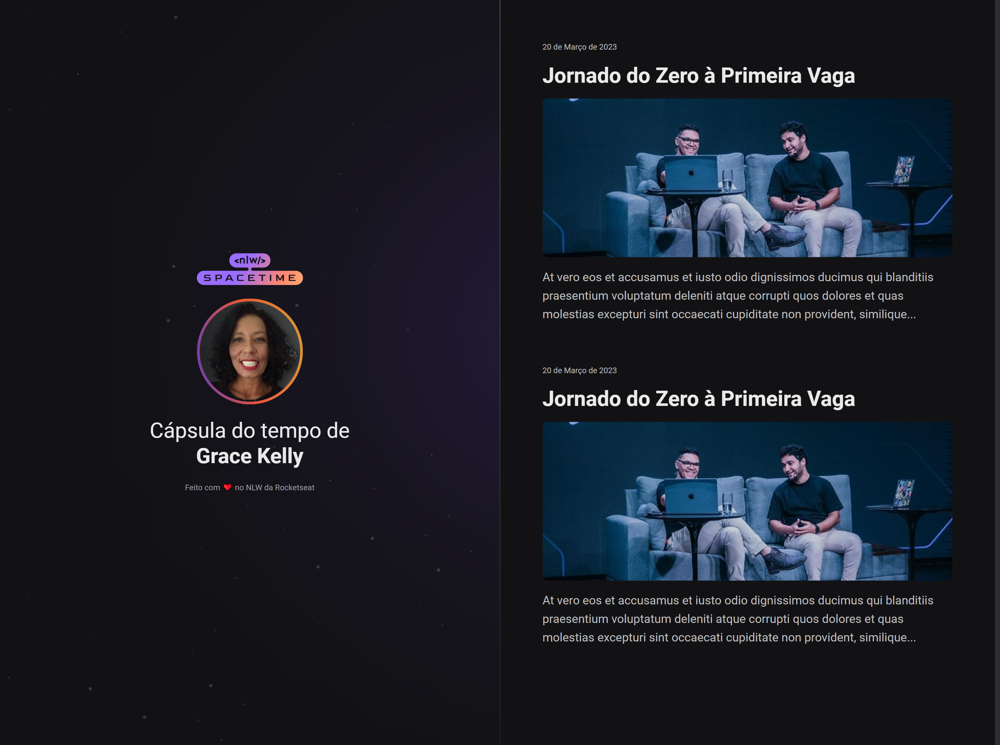

# Spacetime

**Introdução ao HTML e CSS**
(_Vide link do projeto em About)_

**NLW 2023 - Trilha Explorer - Rocketseat** 🚀 💜

## 🔰 Tecnologias
Projeto desenvolvido durante a NLW da Rocketseat com as seguintes tecnologias:

**HTML**

**CSS**

**Git e Github**

## 📚 Aprendizados
Nesse evento reforcei meus aprendizados sobre responsividade e conheci a funcionalidade -webkit- para estilizar o scrollbar.

## 👩🏽‍💻 Autora
[Grace Kelly](https://github.com/gksouza)

## 🤸‍♀️ Adoro uma prosa! #bora conversar?
https://www.linkedin.com/in/gkos22/

gkoliver2020@gmail.com